# PLCnext Technology - OpcUaMethods

[](LICENSE)
[](https://www.phoenixcontact.com/plcnext)
[](https://www.plcnext-community.net)

This procedure describes the basic steps for creating an OPC UA method.

In this example, the OPC UA method will be used to call a PLCnext Engineer function block instance from an OPC UA client.

The procedure uses a custom OPC UA "Information Model", which in this case is generated using the UaModeler tool from Unified Automation. This technique can also be applied when using [standard OPC UA information models](https://opcfoundation.org/developer-tools/specifications-opc-ua-information-models) for various industries and applications.

## Project details

|Description   | Value      |
|--------------|------------|
|Created       | 24.02.2021 |
|Last modified | 24.02.2021 |
|Controller    | AXC F 1152; AXC F 2152; AXC F 3152 |
|Firmware      | 2021.0 LTS |

## Background reading

- [Unified Architecture](https://opcfoundation.org/about/opc-technologies/opc-ua/)
- [OPC UA information model](https://www.plcnext.help/te/Service_Components/OPC_UA_Server/OPC_UA_information_models.htm)
- [UA Modelling Best Practices](https://opcfoundation.org/wp-content/uploads/2020/09/OPC-11030-Whitepaper-UA-Modeling-Best-Practices-1.00.00.pdf)

## Prerequisites for this example

- PLCnext Control device with firmware 2021.0.0 or later, and at least one Axioline I/O module.
- PLCnext Engineer version 2021.0.1 or later.
- [UaModeler](https://www.unified-automation.com/products/development-tools/uamodeler.html) from Unified Automation.
- [UaExpert](https://www.unified-automation.com/products/development-tools/uaexpert.html) from Unified Automation.

## Example description

In this example, we will create an OPC UA method that retrieves a single item of Parameter, Diagnostics and Information (PDI) data from an Axioline I/O module connected to the PLC.

The PDI data available for each type of Axioline I/O module is described in the data sheet for that I/O module. Data sheets can be downloaded from the Phoenix Contact website.

The "address" of each item of PDI data can be uniquely identified using four integers:

- Slot - the location of the I/O module in the Axioline bus.
- Subslot - the location of the sub-module (if any) in the slot.
- Index - the location of the PDI data item in the I/O module.
- Subindex (only applies when the Index refers to a PDI "record") - the location of a single data item in a PDI record.

Each item of PDI data has a specific data type (e.g. string or integer), however for simplicity our method only returns a string.

This example has limited error checking, e.g. on input parameter values. Thorough error checking would be required for production applications, but it is omitted here for simplicity.

## Procedure

### Create the information model

1. In UaModeler, create a new project.

   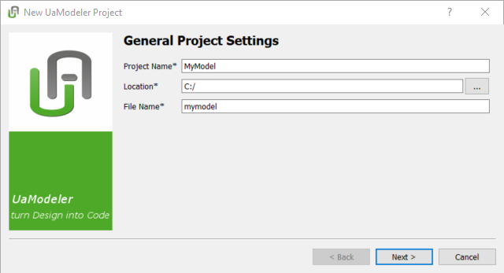

   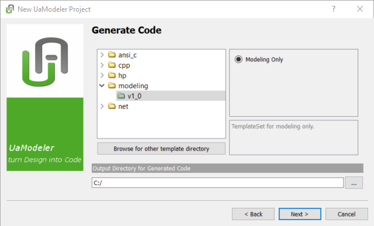

   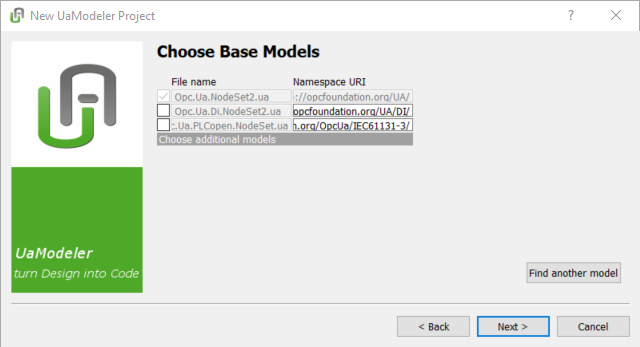

   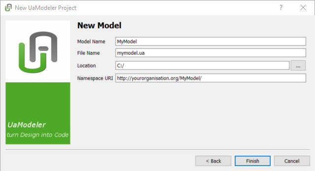

1. In the Information Model pane, create a new Object Type by right-clicking on the BaseObjectType.

   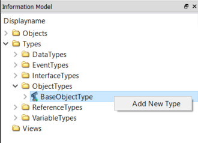

1. Fill in the details of the new type.

   - Give the type a name.
   - Add the method that we will use to read PDI data, with the required input and output arguments. The names and data types of the method arguments should be as shown below.

   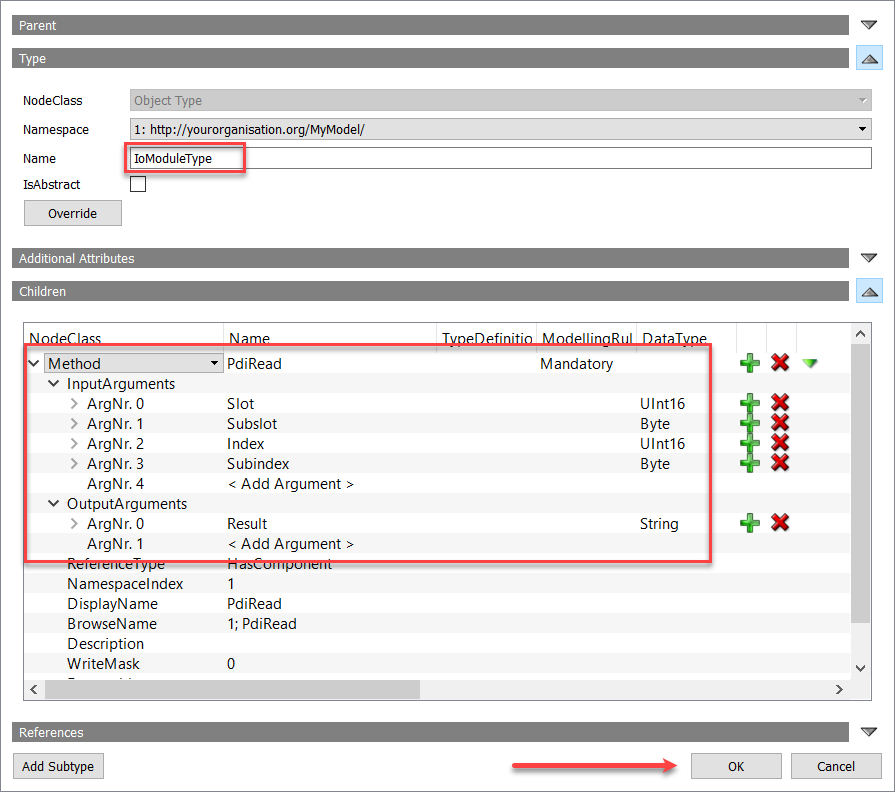

   - When finished, press the OK button.

1. Save the model.

### Create the PLCnext Engineer function block

We now need to create a PLCnext Engineer function block that corresponds to the method definition in the information model.

1. In PLCnext Engineer, create a new project based on the template for your PLC and firmware version.

1. Change the [OPC UA server settings](https://www.plcnext.help/te/Service_Components/OPC_UA_Server/OPC_UA_server_configuration.htm) so that "Visibility of variables" is set to either "Marked" or "All".

1. In a Data Types worksheet, create two new data types.

    ```delphi
   TYPE
       ByteArray100 : ARRAY [1..100] OF BYTE;
   END_TYPE

   TYPE
       WordArray2 : ARRAY [1..2] OF WORD;
   END_TYPE
   ```

1. In the Components pane, create a new function block.

   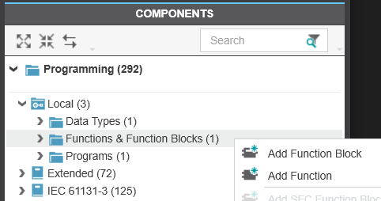

   In this example, the name of the function block is UA_PDI_READ.

1. Add the required OPC UA variables to the function block.

   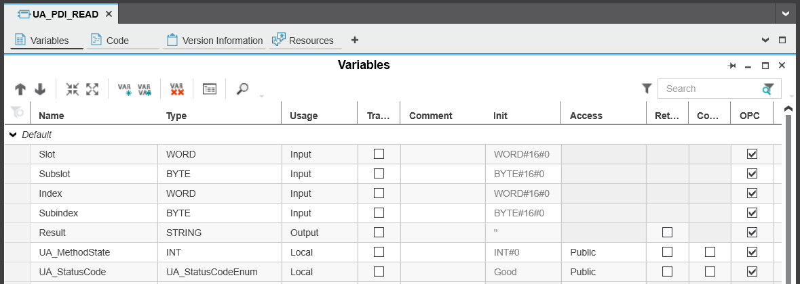

   Please note the following:

   - There must be one variable for each argument that we defined in the information model method.
   - The name, type and usage of these arguments must match the arguments in the information model.
   - There must be two additional variables in our function block: `UA_MethodState` and `UA_StatusCode`. These are defined by the OPC UA standard, and are required for OPC UA method calls to work properly.
   - All these variables must me marked with the OPC attribute.

1. Implement the function block behaviour.

   You can now implement the function block behaviour however you like.

   In this case, our function block:

   - is written using structured text,
   - uses a state machine to retrieve and process the PDI data item,
   - utilises instances of two standard function blocks - PDI_READ and BUF_TO_STRING,
   - assumes that the PDI data item is always of type string,
   - assumes that all FB calls execute successfully.

   The additional local variables used in the FB, and the code that implements the state machine, are shown below.

   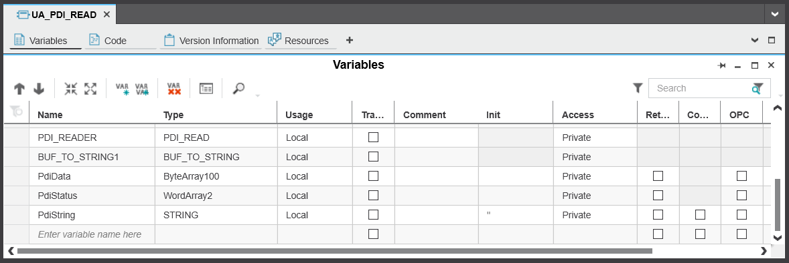

    ```delphi
    // NOTE: Error handling is not implemented here,
    //       but should be for a production application.

    // State machine
    CASE UA_MethodState OF

        0 : // Waiting to be called by eUA Server
            // Writing to UA_MethodState is not allowed in this state
            
        1 : // Start (this state is set by the eUA Server)
            UA_MethodState := 10;
        
        10 : // Request PDI data
            UA_MethodState := 20;

        20 : // Wait for PDI response
            IF PDI_READER.NDR THEN
                UA_MethodState := 30;
            END_IF

        30 : // Convert the response to a String
            UA_MethodState := 40;

        40 : // Wait for string conversion
            IF BUF_TO_STRING1.DONE THEN
                Result := PdiString;
                UA_StatusCode := UA_StatusCodeEnum#Good;
                UA_MethodState := 0; // Finished
            END_IF

    END_CASE

    // Call FB instances
    PDI_READER(
        REQ := (UA_MethodState >= 10),
        SLOT := Slot,
        SUBSLOT := Subslot,
        INDEX := TO_WORD(Index),
        SUBINDEX := Subindex,
        RD_1 := PdiData,
        STATUS := PdiStatus
    );

    BUF_TO_STRING1(
        REQ := (UA_MethodState >= 30),
        BUF_CNT := TO_UINT(PDI_READER.DATA_CNT),
        BUFFER := PdiData,
        DST := PdiString
    );
    ```

### Create an instance of the function block

1. In PLCnext Engineer, create an instance of the function block in the Main program.

   In this example, the name of the FB instance is UA_PDI_READ1.

   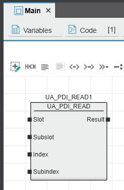

1. Make sure that an instance of the Main program has been created in a cyclic task.

   In this example, the name of the program instance is MainInstance.

   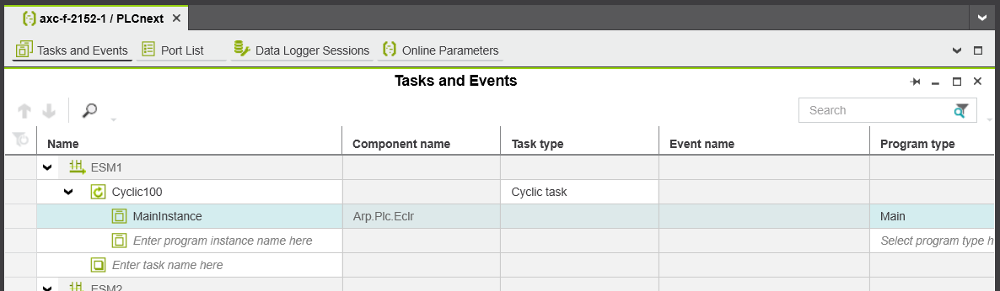

1. Write and start the PLCnext Engineer project on the PLC.

### Create an object in the information model, and link it to the function block instance

So far, the OPC UA information model only contains a type definition, which corresponds to the function block definition in PLCnext Engineer. In the same way that we created an instance of our function block in PLCnext Engineer, we will now define an object (i.e. an instance of our type) in the OPC UA information model. We will then link this object to the function block instance in our PLCnext Engineer project.

1. In the UaModeler Information Model pane, add a new instance to the Objects folder.

   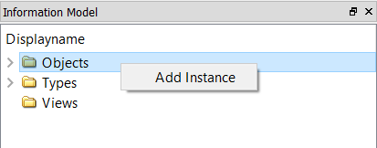

1. Fill in the details of the new object.

   - Give the object a name.
   - Specify the type of the new object - this must be the type that we created earlier.
   - When finished, press the OK button.

   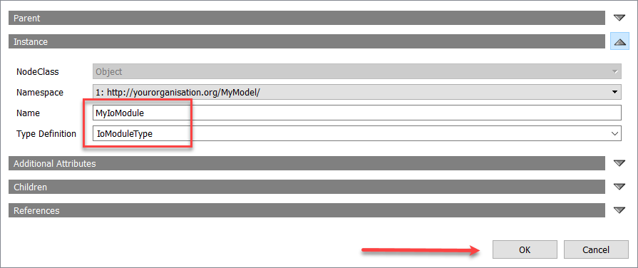

1. Select the method in the new object.

1. With the method in the new object selected, view the user-defined extensions for that method.

   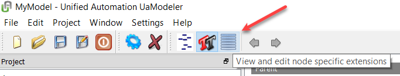

   This button may need to be enabled in the UaModeler Settings window:

   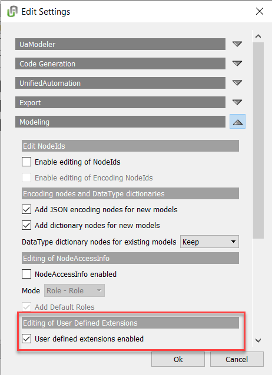

1. Add an extension that links the method to the PLCnext Engineer function block instance.

   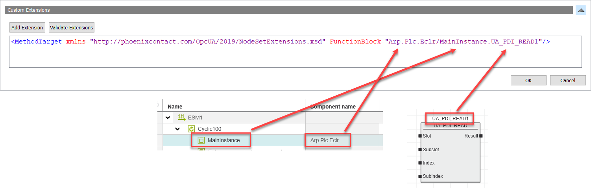

   - The format of the extension is:<br/>`<MethodTarget xmlns="http://phoenixcontact.com/OpcUA/2019/NodeSetExtensions.xsd" 
                   FunctionBlock="COMPONENT/PROGRAM.FUNCTION"/>`
   - The name of the function block instance must be fully qualified with the component name and the program instance name.
   - When finished, press the OK button.

1. Save the model.

### Load the information model into the OPC UA server

1. In UaModeler, export the OPC UA information model as an XML file in [NodeSet](https://opcconnect.opcfoundation.org/2017/04/using-nodeset-files-to-exchange-information/) format by right-clicking on the model.

   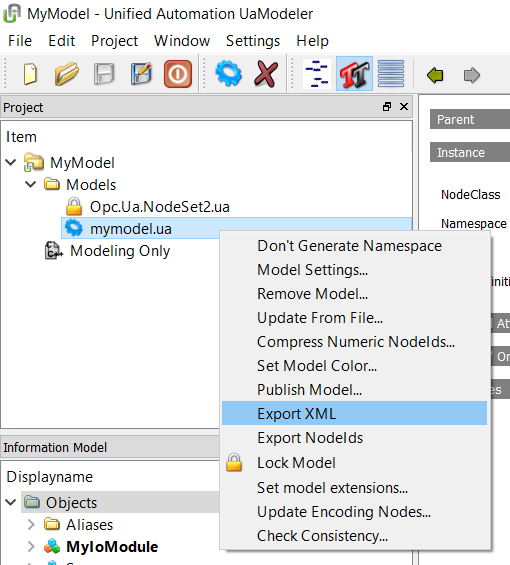

1. [Copy](https://www.plcnext.help/te/Operating_System/Connecting_to_the_controller.htm#for_copying_or_) the exported XML file to the following directory on the PLC:

    ```text
    /opt/plcnext/projects/Default/Services/OpcUA/NodeSets/
    ```

1. Restart the OPC UA server on the PLC to load the new model.

    - Restart the PLCnext Runtime, or
    - Cycle power to the PLC.

    Note: Restarting the PLC from PLCnext Engineer does **not** restart the OPC UA server.

### Execute the method from an OPC UA client

1. In UaExpert, [connect to the PLC](https://youtu.be/j8d_tzJsqrs?t=176) in the usual way.

1. Call the PdiRead function on your object.

   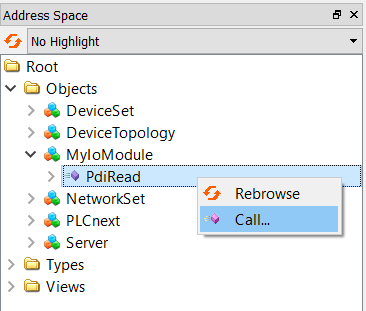

   The list of valid PDI index and Subindex values is given in the data sheet for each Axioline I/O module.

   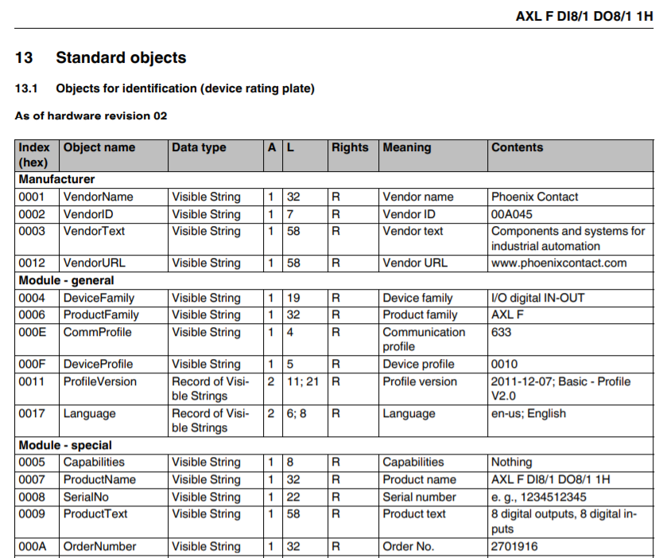

   When the "Call" button is pressed, the state machine in the function block instance is activated, and the value of the PDI data item is returned.

   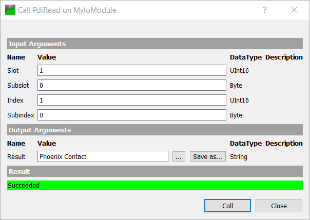

### Bonus exercise

In some cases you may want to allow users to select an input argument value from a fixed list. For example, in this case we can force the user to select the Index value from a list of known valid options.

Procedure:

1. In UaModeler, create a new Enumerated DataType.

   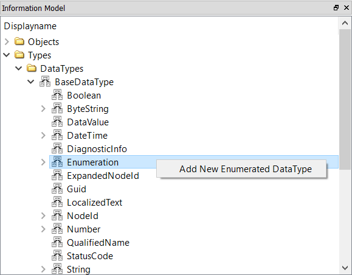

1. Fill in the details of the new type.

   - Give the type a name.
   - Add the values that the user can select, including a string that indicates what each value means.

   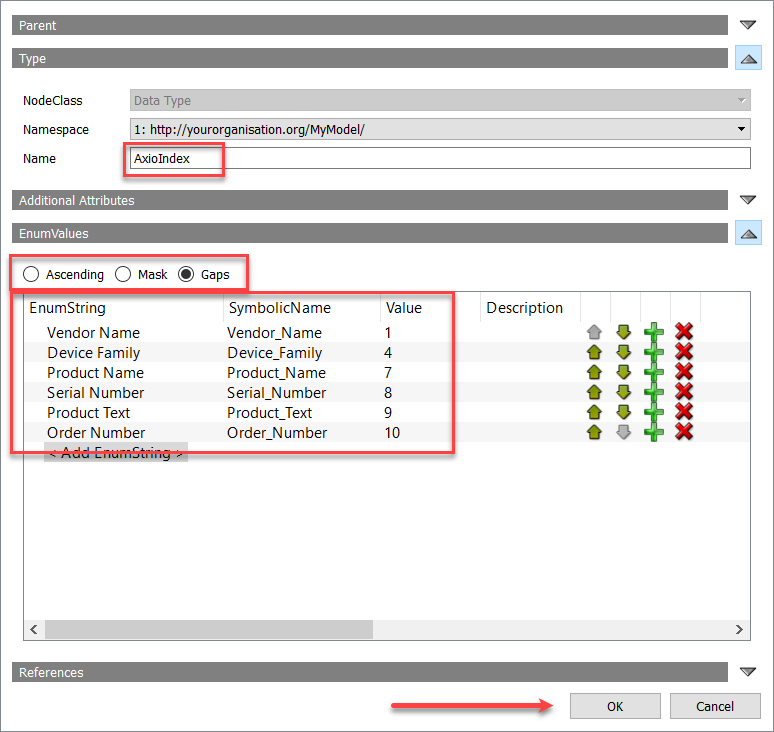

   - When finished, press the OK button.

1. Change the type of the Index argument to the Enumerated data type.

   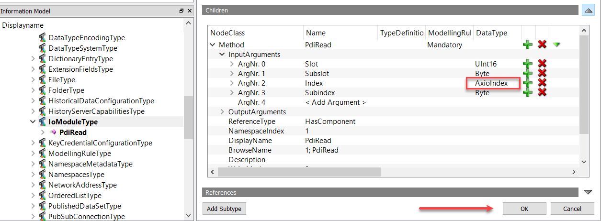

   - When finished, press the OK button.

1. Save the model.

1. Export the XML file.

1. Copy the XML file to the PLC.

1. In PLCnext Engineer, change the type of the Index input.

   Enumerated data types are always of type Int32, so the type of the Index input on the function block must be changed to DINT.

   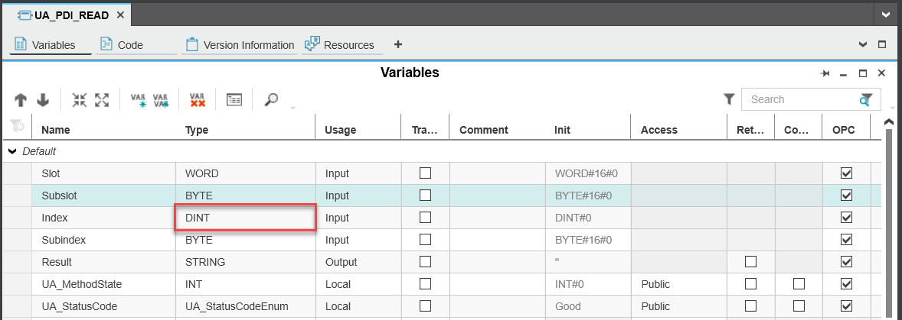

1. Write and start the PLCnext Engineer project.

1. In UaExpert, call the method.

   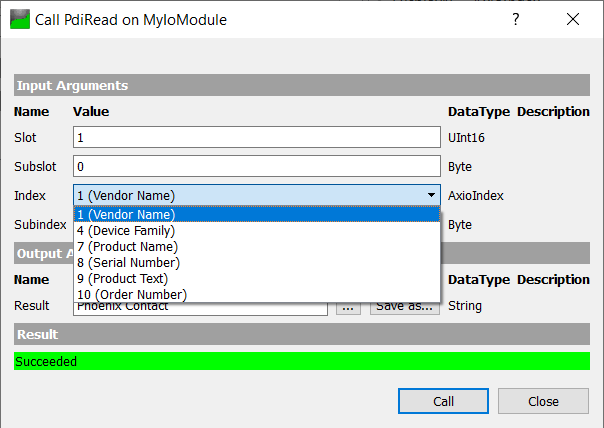

   Now, the Index value must be selected from a fixed list of options.

## Next steps

Rather than building your own information model from scratch, it is worth considering a standard information model for your specific industry or application type. The PLCnext Info Center gives [an example](https://www.plcnext.help/te/Service_Components/OPC_UA_Server/OPC_UA_integrate_external_information_models.htm) of how to use the standard [PA-DIM information model](https://www.fieldcommgroup.org/sites/default/files/technologies/PA%20DIM%20white%20paper%201.0.pdf) in UaModeler with a PLCnext Engineer project.

## Problems?

- [Check the Output.log file](https://pxc1.esc-eu-central-1.empolisservices.com/service-express/portal/project1_p/document/iu-45-85e4a3ef-5699-4c4f-b7b9-4a04246e53d3?context=%7B%7D) on the PLC for messages from the OPC UA server.
- Ask for help in the [PLCnext Community Forum](https://www.plcnext-community.net/en/discussions-2-offcanvas/forums.html).

If you find a mistake in this procedure, or if you would like to suggest improvements or new features, please [open an issue](https://github.com/PLCnext/OpcUaMethods/issues).

## License

Copyright (c) Phoenix Contact GmbH & Co KG. All rights reserved.

Licensed under the [MIT](/LICENSE) License.
